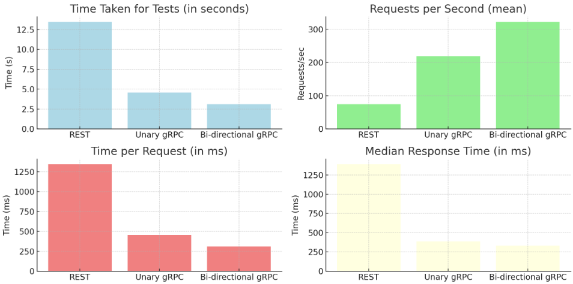

# Сервис платежей

Проект включает два микросервиса: **AccountService** и **PaymentService**, предназначенных для наглядного сравнения двух типов взаимодействия между сервисами: через **REST** и **gRPC**.

---

## Описание

- **AccountService** — управляет аккаунтами пользователей и их балансами.
- **PaymentService** — обрабатывает платежи и вызывает методы **AccountService** для изменения баланса.

Проект демонстрирует два способа взаимодействия:
- **REST** 
- **gRPC** 

---

## Основная задачи

- Разработать API с которым можно будет сравнить скорость и производительность: **REST** и **gRPC** 

---

## Бенчмарки

Для оценки производительности я использовал **Apache Benchmark**. 

При 1000 запросах к API в 100 разных одновременных потоках, я получил такие результаты:

